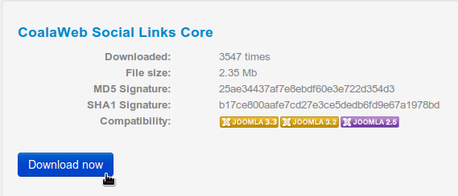
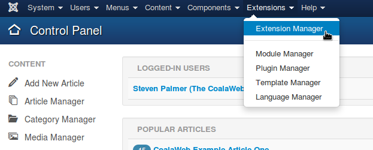
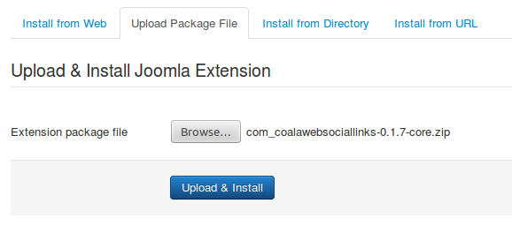
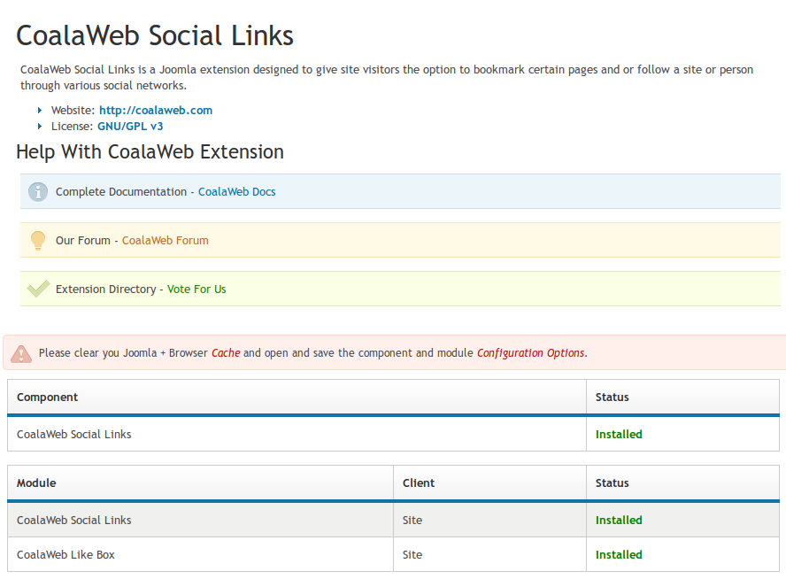

## Table of Contents {#toc}
1.  [Install Guide](#install-guide)
    -   [Upload Package File](#upload)
    -   [Install From Directory](#directory)
    -   [Install From URL](#url)
    -   [Install From Web \[J3.+\]](#web)
2.  [Un-install Guide](#uninstall-guide)
    -   [Uninstall All Parts](#uninstall-all)
    -   [Uninstall Some Parts](#uninstall-some)
3.  [Extra Info](#extra-info)
4.  [Need More Help?](#more-help)

##Install Guide {#install-guide}
### Upload Package File {#upload}

The first method of installing a CoalaWeb extension we are going to cover is the 
**Upload Package File** method. This is the most common method for installing Joomla 
extensions so we will start here.

The first thing we need is a zipped up extension package ready to install so 
drop by the **Downloads** section of coalaweb.com and grab a copy of the 
extension you want to install. *[Figure-1]*

Note: Before attempting to install a CoalaWeb extension make sure you system meets the minium requirements.

{.coalaweb-docs}

Next log into the backend of your Joomla installation and open up the 
**Extension Manager** and then select the **Upload Package File** option.

It can be found in this location. *[Figure-2]*

`Extensions → Extension Manager → Upload Package File`

{.coalaweb-docs}

Then use the **Browse** button to find and select the package you downloaded in the first 
step. *[Figure-3]*

{.coalaweb-docs}

Lastly select **Upload & Install** to start the process. The install script
used by CoalaWeb extensions will take care of installing all the related parts of 
the system such as **Modules** and **Plugins** and when it has 
finished you will receive conformation. *[Figure-3]*

Note: Installing an extension can take some time due to consisting of several smaller extensions so please be patient.

{.coalaweb-docs}
