# How to disable a Joomla plugin

There are lots of reasons why you might want to disable a plugin ranging from not needing it anymore to stopping a plugin from producing a website crash. In some cases just a missing variable that a plugin is looking for is enough to halt an entire website and in these cases the quickest fix is to disable the offending plugin.

## Table of Contents
1.  [Plugin Manager](#opt-1)
2.  [Edit Extension Files](#opt-2)
2.  [Edit Database](#opt-3)
2.  [Tips](#tips)
    -   [Use Error to identify plugin](#tip-1)
4.  [Need More Help?](#more-help)

***
Note: CoalaWeb guides refer to a Joomla 3.+ installation but the steps are very similar for a Joomla 2.5.

## 1. Plugin Manager

The first way we are going to discuss is the method you will use in most cases and it involves using the **Plugin Manager**. *[Figure-1]*

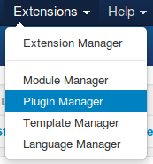{.coalaweb-docs}

The hardest part of this method is finding the plugin you're looking for, in our example we are going to be disabling the **System - CW Gears** plugin. The easiest way to find it would be to type **Gears** in the search box. *[Figure-1a]*

{.coalaweb-docs}

#### What If you aren’t exactly sure what the plugin is called? 

To start with you can use some of the filters to reduce the amount of plugins you will have to look through. For example if you are trying to disable a plugin we can assume it is currently enabled so setting the **Select Status** filter to **Enabled** would help. *[Figure-1b]*

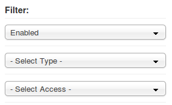{.coalaweb-docs}

Once you have found the plugin you are looking for its just a matter of clicking the **Status** icon to **Disable** or **Enable** it. *[Figure-1c]*

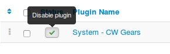{.coalaweb-docs}

If you want to disable **multiple** plugins at the same time you use the **check-boxes** next to each of them and then use the **Disable** or **Enable** button from the top menu. *[Figure-1d]*

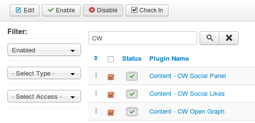{.coalaweb-docs}

## 2. Edit Extension Files

If a plugin is for example stopping you from accessing the **Plugin Manager** your next logical step would be disabling it via a **File Manager** or **FTP Client**. With this method again it is dependent on knowing the name of the plugin you are trying to disable including what plugin group it belongs to as it will be stored in directory of the same name. If your website is inaccessible then there is a good chance the plugin to blame is from one of these three groups.

-   plugins->authentication
-   plugins->content
-   plugins->system

For this example I will be access the root of my website and then the plugins directory via **FTP** and it will look something like the image below. *[Figure-2]*

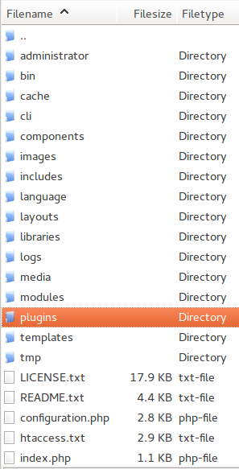{.coalaweb-docs}

Once again we will be using the **System - CW Gears plugin** for this example so we will need to drill down through the following directories.

`plugins -> system -> cwgears`

The main two plugin files will be the **php** and **xml** files with the same name as the plugin’s directory so in this example. *[Figure-2a]*

-   cwgears.php
-   cwgears.xml

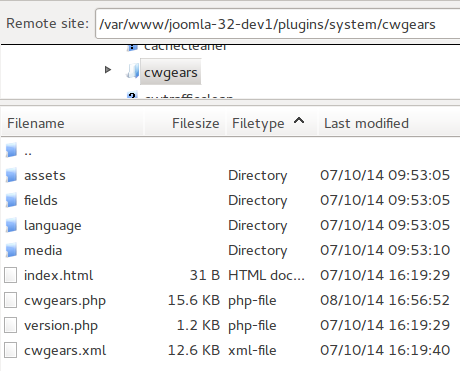{.coalaweb-docs}

To disable it we want to rename or remove the php file. In my opinion its better to rename it and once you get access to your site again you can always uninstall it through the **Plugin Manager**. For this example we will rename it to **cwgears.php-off**. *[Figure-2b]*

{.coalaweb-docs}

Now you should be able to gain access your website and take the appropriate action.

## 3. Editing the Database

This option is by far the most **risky** due to editing a database table so it should be your last resort. The second option covered in this guide should be all you ever need but if not read on.

In this example we will be using **phpMyAdmin** to access the database as it is the most widely used tool and normally comes packaged with your administration portal such as **Cpanel**. If you are using another tool to administer your database the principals will be the same.

Once you have logged into to **phpMyAdmin** select the database associated with your website from the left. You should now be looking at a list of all your website's tables but the one we are interested in is the **Extensions** table so once you have found it click on it.  *[Figure-3]*

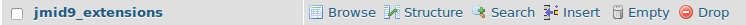{.coalaweb-docs}

In the next window you will see a list of all the extension installed on your website including the components, modules and plugins so to make it easier to find the one we are looking for we are going to use the **Search** tab from the top. *[Figure-3a]*

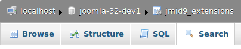{.coalaweb-docs}

In the next window you have several ways to filter the extensions I prefer to use the **Element** field as its the same as the directory the plugin is stored in but you could use type(plugin) and or folder(system) for example to help find the one you are looking for. When you are ready click the **Go** button in the bottom right to start the search which in my case returned the plugin I was looking for with the search field I used highlighted. You may also notice that it has a **1** in the **Enabled** column telling us that it is currently enabled. *[Figure-3b]*

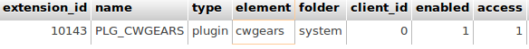{.coalaweb-docs}

Now to disable the plugin in question just click the **Inline Edit** button to the left which will allow us to make quick changes to the table. *[Figure-3c]*

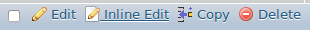{.coalaweb-docs}

In the next window look for the column titled **enabled** and change the **1** to a **0** and click **Save**. Thats it the plugin is now disabled and you should have gained access again to your website. If you need to disable more plugins just repeats these steps.

## Tips

#### Use Error to identify plugin

If you see an **Error Message** take note of the **File** that is causing the problem as there is a good chance it will tell you which plugin is to blame. *[Figure-4]*

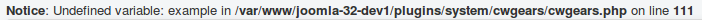{.coalaweb-docs}

## Need More Help

Do you have a question that wasn't covered by the GUIDE? Then it's time to drop by the [Forum](http://coalaweb.com/forum/index) I'm sure we can help.
