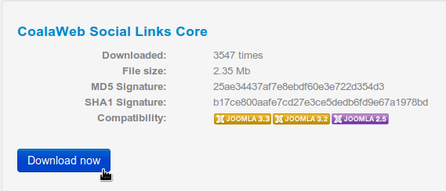
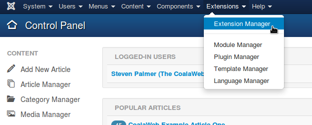
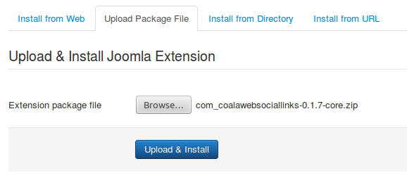
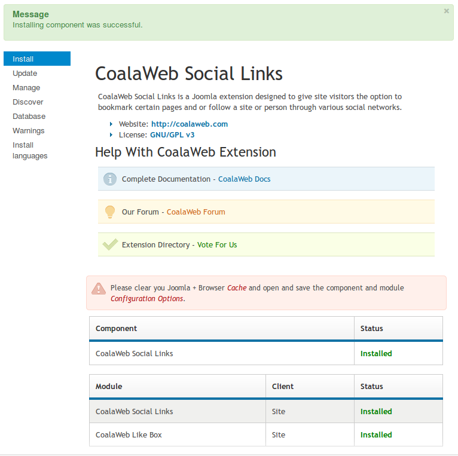
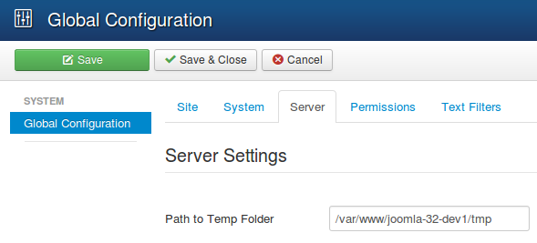
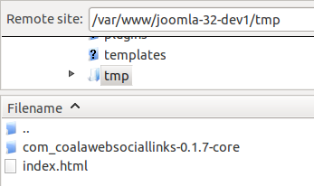
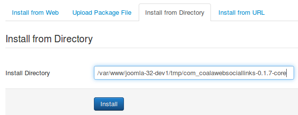

## Table of Contents {#toc}
1.  [Install Guide](#install-guide)
    -   [Upload Package File](#upload)
    -   [Install From Directory](#directory)
    -   [Install From URL](#url)
    -   [Install From Web \[J3.+\]](#web)
2.  [Uninstall Guide](#uninstall-guide)
    -   [Uninstall All Parts](#uninstall-all)
    -   [Uninstall Some Parts](#uninstall-some)
3.  [Extra Info](#extra-info)
4.  [Need More Help?](#more-help)

##Install Guide {#install-guide}

Note: CoalaWeb guides refer to a Joomla 3.+ installation but the steps are very similar for a Joomla 2.5.

### Upload Package File {#upload}

The first method of installing a CoalaWeb extension we are going to cover is the 
**Upload Package File** method. This is the most common method for installing Joomla 
extensions so it's a good place to start.

The first thing we need is a zipped up extension package ready to install so 
drop by the **Downloads** section of [CoalaWeb](http://coalaweb.com) and grab a copy of the 
extension you want to install. *[Figure-1]*

Note: Before attempting to install a CoalaWeb extension make sure you system meets the minium requirements.

{.coalaweb-docs}

Next log into the backend of your Joomla installation and open up the 
**Extension Manager** and then select the **Upload Package File** option.

It can be found in this location. *[Figure-2]*

`Extensions → Extension Manager → Upload Package File`

{.coalaweb-docs}

Then use the **Browse** button to find and select the package you downloaded in the first 
step. *[Figure-3]*

{.coalaweb-docs}

Lastly select **Upload & Install** to start the process. The install script
used by CoalaWeb extensions will take care of installing all the related parts of 
the system such as **Modules** and **Plugins** and when it has 
finished you will receive conformation. *[Figure-3]*

Note: Installing an extension can take some time due to consisting of several smaller extensions so please be patient.

{.coalaweb-docs}

### Install from Directory {#directory}

The second method of installing a CoalaWeb extension we are going to cover is the 
**Install from Directory** method. This is a great way to install larger 
packages on system with limited resources. If your system timed out using the 
first method then this is the next logical step.

The first thing we need is an extension package ready to install so 
drop by the **Downloads** section of [CoalaWeb](http://coalaweb.com) and grab 
a copy of the extension you want to install. The difference with this method of 
installing an extension is that we need it unzipped so you may as well do it now. *[Figure-1]*

Note: Before attempting to install a CoalaWeb extension make sure you system meets the minium requirements.

{.coalaweb-docs}

Next we need to get the freshly downloaded package onto our server and into the
**tmp** directory so lets start by checking its location. Log into the backend 
of your Joomla installation and then head over to your **Server Settings** and check the
**Path to Temp Folder**. This is where we will be putting the package.

It can be found in this location. *[Figure-2]*

`System → Global Configuration → Server → Path to Temp Folder`

{.coalaweb-docs}

Now we know where we want the package so it's time to fire up your FTP client 
and navigate to the directory we just checked. Once we have found it upload the 
package we download in the first step into the **tmp** directory. *[Figure-3]*

Note: Make sure the package is unzipped/extracted.

{.coalaweb-docs}

Now back to your Joomla installation and open up the 
**Extension Manager** and then select the **Install from Directory** option.

It can be found in this location.

`Extensions → Extension Manager → Install from Directory`

The tmp directory location should already be filled in for you and it should be the
same as the directory we check in a previous step. Next add the the package name 
to the end. *[Figure-4]*

{.coalaweb-docs}

Lastly select **Install** to start the process. The install script
used by CoalaWeb extensions will take care of installing all the related parts of 
the system such as **Modules** and **Plugins** and when it has 
finished you will receive conformation. *[Figure-5]*

Note: Installing an extension can take some time due to consisting of several smaller extensions so please be patient.

{.coalaweb-docs}