## Table of Contents
1.  [Guide](#guide)
2.  [Need More Help?](#more-help)

## Guide to creating a Facebook Application
As you know, CoalaWeb Social Links allows you to share content through many social networks, including Facebook. Up until version 0.1.8 the Facebook share options of the **Social Links** and **Tabs** modules had been carried out using the Facebook **Sharer** code. But recently, Facebook announced that they have deprecated this code in preference of their new **Share Dialog** system, which requires a Facebook **App ID**.

To get a Facebook App ID requires you to first create a Facebook Application but don’t worry it’s an easy process which we will walk your through in the following guide.

### Step 1
To get started lets head over to the Facebook developer's [website](https://developers.facebook.com) You will need to log into your Facebook account using your normal credentials before being able to access this page. *\[Figure-1\]*

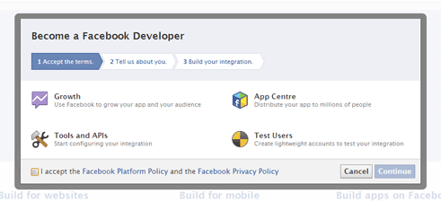{.coalaweb-docs}

Now that we are in the **Developers** section of Facebook we can start creating out new App. First select the **Apps** dropdown menu from the top and choose **Add a New App**. *\[Figure-2\]*

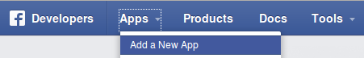{.coalaweb-docs}

In the next window select **Website** from the options. *\[Figure-3\]*

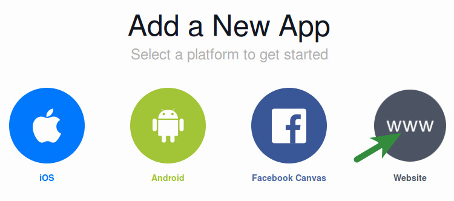{.coalaweb-docs}

In the next window select **Skip Quickstart** from the top right. *\[Figure-4\]*

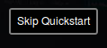{.coalaweb-docs}

In the **Create a New App** window give your new application a **Display Name**.

This will be seen in the bottom of the pop up **Share** dialog so something related to your website is best.

You can leave the **Namespace** blank and **No** for the test version question. Lastly on this page you need to choose a **Category** for the App in this example I have chosen **Utilities** but for more info on categories try this [Link](https://developers.facebook.com/docs/games/appcenter/categories) *\[Figure-5\]* 

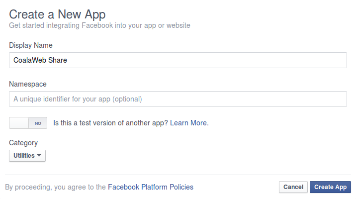{.coalaweb-docs}

When you click **Create App** you will be confronted with a Captcha so fill it in and click **Submit**. *\[Figure-6\]*

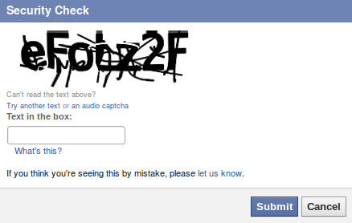{.coalaweb-docs}

###Congratulations! You’ve just created a Facebook App!

You should now be looking at your newly created application, you will note that under your **Application's Name** there is the sentence:

**This app is in development mode**

We still have a couple more steps before we are ready to use the **App ID**. *\[Figure-7\]*

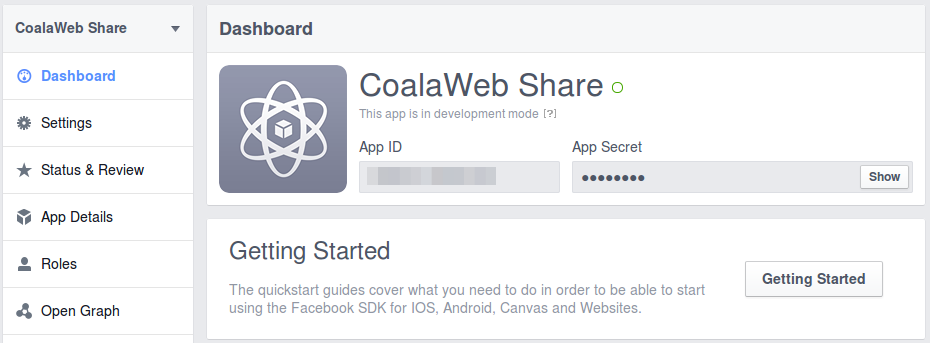{.coalaweb-docs}

On the left side of your **Dashboard**, click **Settings** from the menu and make sure you looking at the **Basic** tab. In this window you will need to enter the **App Domains** and **Contact Email** for your app. *\[Figure-8\]*

Do not include the **http** part of the domain.

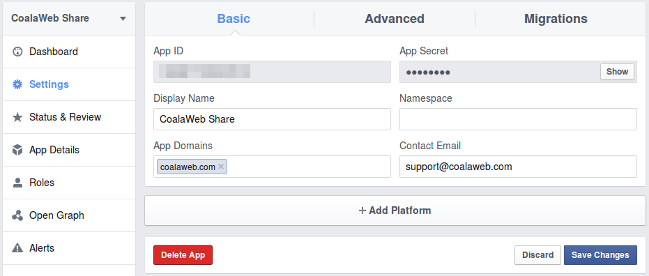{.coalaweb-docs}

Before clicking **Save Changes** we need to add a platform so yes you guessed it we will now use the **Add Platform** button. *\[Figure-9\]*

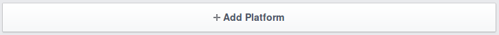{.coalaweb-docs}

From the next window choose **Website** for your platform. *\[Figure-10\]*

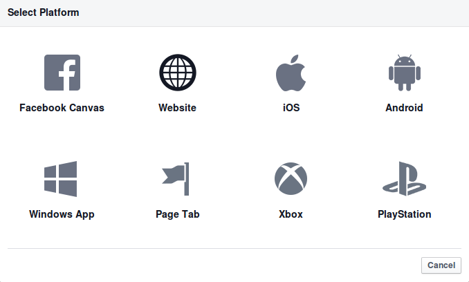{.coalaweb-docs}

In the next window enter your website address into the **Site URL** field and then choose **Save Changes**. *\[Figure-11\]*

You **DO** want to include the full URL, including the http:// 

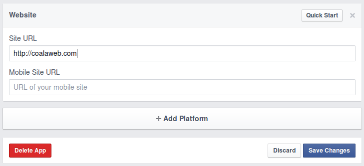{.coalaweb-docs}

Lets now make your App live and available to all users. To do this click the **Status & Review** option from menu to the left and then toggle the button at the top that says **Do you want to make this app and all its live features available to the general public?**. *\[Figure-12\]*

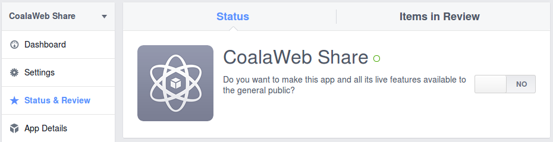{.coalaweb-docs}

Once you select **Yes** you will be confronted with a confirmation screen select **Confirm**. *\[Figure-13\]*

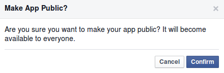{.coalaweb-docs}

Now when you are returned to the **Dashboard** you will see a solid green circle next to your **Applications Name** and under it the sentence:

**This app is public and available to all users**  *\[Figure-14\]*

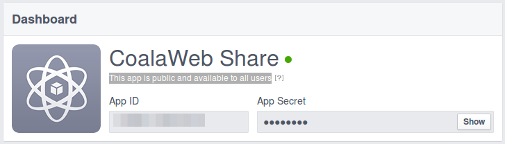{.coalaweb-docs}

###Your new Application ID is ready for use in CoalaWeb Social Links!

## Need More Help

Do you have a question that wasn't covered by the GUIDE? Try the [FAQ](http://coalaweb.com/support-menu/documentation/item/coalaweb-social-links-faq).

Do you have a question that wasn't covered by the GUIDE or the FAQ? Then it's time to drop by the [Forum](http://coalaweb.com/forum/index) I'm sure we can help.