## Table of Contents
1.  [Component Guide](#component-guide)
    -   [Control Panel](#control-panel)
    -   [Inbuilt Help](#help)
    -   [Extension Options](#options)
        - [1. General Options](#options-general)
        - [2. Like Plugin Options \[Pro Version\]](#options-content)
        - [3. Share Plugin Options \[Pro Version\]](#options-share)
        - [4. Panel Plugin Options \[Pro Version\]](#options-panel)
        - [5. Social Metadata Plugin Options \[Pro Version\]](#options-og)
        - [6. Update Options](#options-updates)
        - [7. Where Is My Download ID \[Pro Version\]](#options-downloadid)
        - [8. Component Permissions](#options-permissions)

2.  [Social Module Guide](#module)
    -   [General Display Options](#mod-general)
    -   [Create Custom Theme](#mod-custom-theme)
    -   [Share This General](#mod-bookmark-gen)
    -   [Share This Social](#mod-bookmark-soc)
        - [1. Create Facebook Application](#mod-bookmark-fbapp)
    -   [Follow Us General](#mod-follow-gen)
    -   [Follow Us A-Z](#mod-follow-az)
    -   [Follow Us Custom](#mod-follow-cus)
    -   [Advanced Options](#mod-advanced)

3.  [Social Tabs Guide \[Pro Version\]](#module-tabs)
    -   [First Thing](#mod-tabs-first)
    -   [General Display Options](#mod-tabs-general)
    -   [Share General](#mod-tabs-share-gen)
    -   [Share A-Z](#mod-tabs-share-az)
        - [1. Create Facebook Application](#mod-tabs-fbapp)
    -   [Follow Us A-Z](#mod-tabs-follow-az)
    -   [Follow Us Custom](#mod-tabs-follow-cus)
    -   [Tab Colors](#mod-tabs-colors)
    -   [Tab Order](#mod-tabs-order)
    -   [Advanced Options](#mod-tabs-advanced)

4.  [Like box Module Guide](#module-lbox)
    -   [General Options](#mod-lb-general)
    -   [Layout Options](#mod-lb-layout)
    -   [Style Options](#mod-lb-style)
    -   [Extra Options](#mod-lb-extra)
    -   [Advanced Options](#mod-lb-advanced)

5.  [Google Plus Module Guide \[Pro Version\]](#module-gplus)
    -   [General Options](#mod-gplus-general)
    -   [Layout Options](#mod-gplus-layout)
    -   [Advanced Options](#mod-gplus-advanced)

6.  [Plugin Guide](#plg)
    -   [Content Plugin - Social Likes \[Pro Version\]](#plg-content)
    -   [Content Plugin - Social Share \[Pro Version\]](#plg-share)
    -   [Content Plugin - Social Panel \[Pro Version\]](#plg-panel)
    -   [Content Plugin - Social Metadata \[Pro Version\]](#plg-og)
    -   [System Plugin - Facebook JS](#plg-fbjs)
    -   [System Plugin - Zoo \[Pro Version\]](#plg-zoo)
        - [1. Element - Social Likes](#plg-zoo-social)
        - [2. Layout - Open Graph](#plg-zoo-og)

7.  [Need More Help?](#more-help)

## Component
### Control Panel

The **Control Panel** as seen below it is designed to be an easy
starting point, think of it as the components head quarters. While
carrying out tasks you can easily jump from the **Control Panel** to the
different sections and then return before moving onto the next one. *\[Figure-1\]*

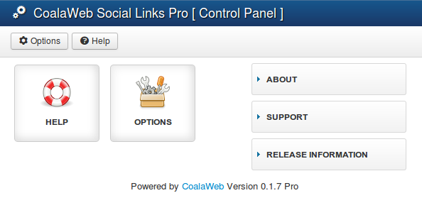{.coalaweb-docs}

### Inbuilt Help

In the control panel or the tool menu you have a help icon that when
clicked will open a pop up wrapper of this specific guide. This gives
you an easy way of checking the functionality of a particular item with
out leaving the control panel. *\[Figure-2\]*

{.coalaweb-docs}

### Extension Options

In the control panel or the tool menu you have an options icon that when clicked will open a new window containing the various extension options.

### 1. General Options

#### Facebook

The first option in this section allows you to load the Facebook JavaScript library through a specifically designed plugin that will ensure it's only loaded once and can be used by all the parts of the Social Links system. *\[Figure-26\]*

{.coalaweb-docs}

The next option is the **Facebook Application ID** which will be used through out the Social Links system both by it's associated **Modules** and **Plugins**. This is a centralized location making it quick and easy to add the ID once and have the whole system use it. This can be overridden in some cases such as the Social Links module if needed.  *\[Figure-26a\]*

{.coalaweb-docs}

#### Twitter

If you want a Twitter username to be added to the end of Tweets generated by the Social Links system with the pre text **via** add it here in the following format @username otherwise leave this option blank. *\[Figure-26b\]*

{.coalaweb-docs}

#### URL Shortener

Note: cURL is necessary for the system to function correctly.

To check if you have cURL installed open up your **PHP Information** page found under

`System → System Information → PHP Information`

and scroll down or search the page looking for something similar to *\[Figure-24\]*

{.coalaweb-docs}

Now that we have made sure cURL is installed lets move onto the configuration options. The first option 
is whether to turn on the shortening system and which service you wish to use (Currently only Google is available).

Next enter the **API Key** your received from your shortening service provider making sure to not leave any extra spaces.

For more info on how to get an API key scroll down to How do I get an API Key?

Next you can choose which URL's you wish to have shortened keeping in mind that the system will alter URLs so in some cases 
the current votes will disappear. Don't worry they aren't lost you can turn off the system and they will return but it works
both ways votes counted while using the shortening service in some cases will disappear when changing back. The decision to 
turn on URL shortening and where will ultimately depend on your circumstances. *\[Figure-24a\]*

I recommend at least turning it for the Social Links module as there aren't any visible counts.

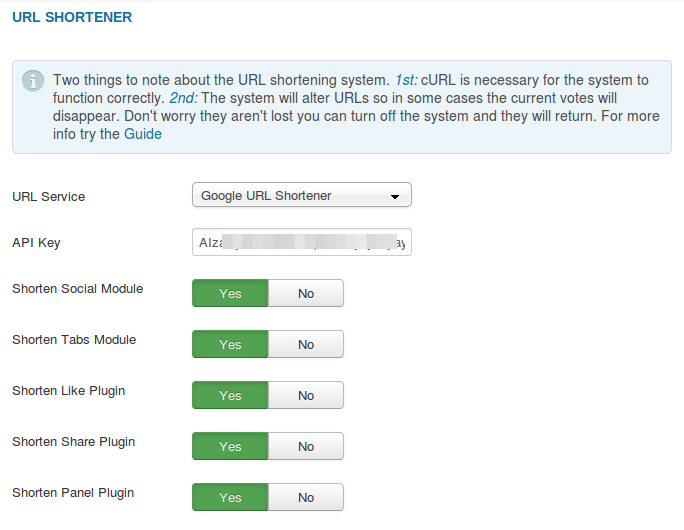{.coalaweb-docs}

#### How do I get an API Key? (Google)

Firstly log into your Google account and then go to the **API Console** using this [link](https://code.google.com/apis/console) you should end up in the **Google Developers Console**  *\[Figure 24c\]*now from the left menu select:

`APIs and auth → APIs`

Scroll down until you find **URL Shortener API** and turn it on. Once it is turned on it should move to the top of your list of APIs 
with **On** in green. *\[Figure-24b\]*

{.coalaweb-docs}

Next select **Credentials** from the left menu and your API Key should be listed to the right under **Public API access**.  *\[Figure-24c\]*

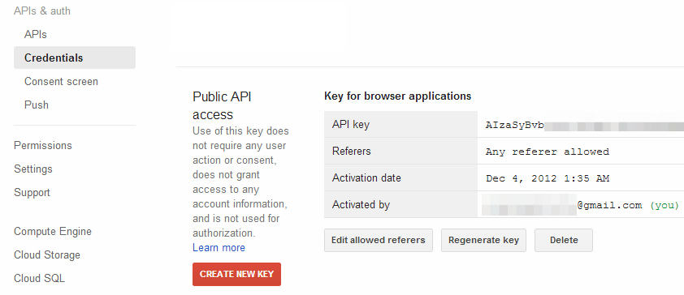{.coalaweb-docs}

### 2. Like Plugin Options \[Pro Version\]

Some of the options selected here will affect the display of the buttons in Joomla, K2 and Zoo.

To make it easier to follow I have broken up the **Like Plugin Options** into three parts.

#### Part 1 - Display Where

The first option is to turn on or off the display of the like social buttons. This option does in essence the same thing as unpublishing the associated plugin with out the hassle of searching through the plugins.

The next option allows you to choose if you want the social buttons to be displayed everywhere for example in each of the articles displayed in a blog layout or only when you have selected a particular article. This will affect the display of the buttons in both Joomla and K2. *\[Figure-3\]*

{.coalaweb-docs}

Next you have an opportunity to select which categories you wish the buttons to be displayed in. If you wish to select more than one just hold down **Shift** on your keyboard and select the categories with your mouse. If you want to exclude any articles use the last input field by entering their IDs one per line. *\[Figure-3a\]*

{.coalaweb-docs}

#### Part 2 - Layout

Next are the **Layout Options** here you can choose to display the buttons above the content, below the content or both. The buttons also have style options associated with them, you can display them in **Vertical** \[Bubble\], **Horizontal** or with **No Count**. The only exception is the **Mail Count** button that can only be displayed in **Vertical**. *\[Figure-3b\]*

{.coalaweb-docs}

#### Part 3 - Social
Next are the **Social Options** here you can chose which social networks
you wish to display. These options will affect the display of the
buttons in Joomla, K2 and Zoo. *\[Figure-3c\]*

{.coalaweb-docs}

### 3. Share Plugin Options \[Pro Version\]

Some of the options selected here will affect the display of the buttons in Joomla, K2 and Zoo.

To make it easier to follow I have broken up the **Share Plugin Options** into three parts.

#### Part 1 - Display Where

The first option is to turn on or off the display of the share social buttons. This option does in essence the same thing as unpublishing the associated plugin with out the hassle of searching through the plugins.

The next option allows you to choose if you want the social buttons to be displayed everywhere for example in each of the articles displayed in a blog layout or only when you have selected a particular article. This will affect the display of the buttons in both Joomla and K2. *\[Figure-27\]*

{.coalaweb-docs}

Next you have an opportunity to select which categories you wish the buttons to be displayed in. If you wish to select more than one just hold down **Shift** on your keyboard and select the categories with your mouse. If you want to exclude any articles use the last input field by entering their IDs one per line. *\[Figure-27a\]*

{.coalaweb-docs}

#### Part 2 - General

Next are the **General Options** here you can choose to display the buttons above the content, below the content or both. The next two options control what icons are displayed and their size. The icon themes are the same ones used by the Social Links module making it easy to create a custom theme that can be used by both. For more details on creating a custom theme click [Here](#mod-custom-theme). If you want the links to be set to No Follow select **Yes** for the next option. Lastly if you want them to be opened in a popup window select **Yes** for the **Use Popup** option. *\[Figure-27b\]*

{.coalaweb-docs}

#### Part 3 - Social
Next are the **Social Options** here you can chose which social networks you wish to display. These options will affect the display of both the
buttons in Joomla and K2. If you plan to display the Facebook button you will need to create a Facebook application **first** and then copy and paste the **ID** into the **Component** options under the **General** tab. *\[Figure-27c\]*

{.coalaweb-docs}

#### Create Facebook Application

To get a **Facebook App ID** requires you to first create a Facebook Application but don’t worry it’s an easy process which we will walk your through in this [GUIDE](http://coalaweb.com/support/documentation/item/create-facebook-application "Facebook App Guide").

### 4. Panel Plugin Options \[Pro Version\]

{.coalaweb-docs}

To make it easier to follow I have broken up the **Social Panel Plugin Options** into five parts.

#### Part 1 - Display Where

To make it easy to turn on or off the Social Panel plugin completely I have included a **Load Panel** option this will save you having to open up the plugin manager to disable it. Next you have an opportunity to select which categories you wish the buttons to be displayed in. If you wish to select more than one just hold down **Shift** on your keyboard and select the categories with your mouse. If you want to exclude any articles use the last input field by entering their IDs one per line. *\[Figure-23a\]*

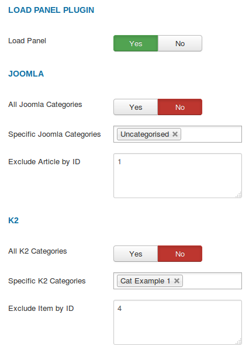{.coalaweb-docs}

#### Part 2 - Layout & Style

Next are the **Layout & Style Options** these options will affect both the Fixed and Collapse style layouts. First you can choose if you want the panel to be visible all the time displayed to the side of the article content or Collapse which will hide the panel off the side of the page. The Collapse option becomes visible by clicking a tab that extends from the side of the page. 

The next option allows you to choose which side you want the panel displayed on.

The next option allows you to choose a **Theme** for the panel. I have included a few and will expand it over time but if you want to create your own have a look below.

The buttons also have style options associated with them, you can display them in **Vertical** \[Bubble\], or with **No Count**. The only exception is the **Mail Count** button that can only be displayed in **Vertical**.

#### Creating your own theme

Creating a theme is easy, just copy the default folder found in:

`media → coalawebsocial → plugins → content → socialpanel → themes`

Give the theme a different name and edit the files as needed. All the
folders located in the themes directory will automatically be listed in
the **Form Theme** select list.

The last option listed under Layout and Style is Top Space this is the
amount of space above the panel and will affect both panel styles. The
top space is measure in % so just enter a number, 15 is the default and
works well in most situations. *\[Figure-23b\]*

The Fixed Style will automatically convert to Collapse when the page reaches a certain size.

{.coalaweb-docs}

#### Part 3 - Fixed Style

The next couple of option only affect the Fixed panel style. First you
can choose the Convert Width if the page is reduced smaller than the
width entered here it will automatically convert to the Collapse style.
The last option in this section is the side space this is the amount of
space between the side of the page and the panel it is measured in % so
just enter a number, 5 is the default and works well in most situations. *\[Figure-23c\]*

{.coalaweb-docs}

#### Part 4 - Collapse Style

The next couple of option only affect the Collapse panel style. First
you can choose the type of button(tab) to want to use to trigger the
display of the panel. If you choose **Text** in the next option you can decide to have the text/button displayed vertically or horizontal. If you choose **Icon** you will have to fill in three
of the next four options. First choose the icon you wish to use it can
be stored locally or you can use an external URL for the image. Next set
the width and height of the icon in pixels. Note: Just enter a number
here with out the px. If you choose to use text which is a a great
option for multilingual sites you can change the displayed text here.
The default text is Share but if you do plan to use it on a multilingual
site it would be better to use the language files to manipulate this
text.

The next few options control the slide effect of the panel. The first
two options control the amount of time the panel takes to open and
close. Durations are given in milliseconds; higher values indicate
slower animations, not faster ones. The default duration is 400
milliseconds. The last two options affect the animation style, you have
a lot to choose from so experiment until you find the ones you
like. *\[Figure-23d\]*

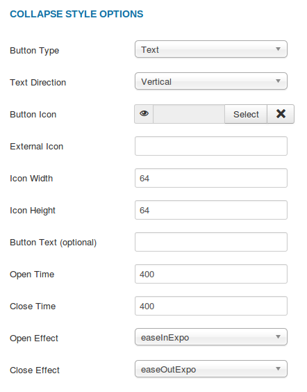{.coalaweb-docs}

#### Part 5 - Social Options

Next are the **Social Options** here you can chose which social networks
you wish to display. These options will affect the display of both the
buttons in Joomla and K2. *\[Figure-23e\]*

{.coalaweb-docs}

### 5. Metadata Plugin Options \[Pro Version\]

The **CoalaWeb Metadata** plugin will help generate meta data in the
**Open Graph** and **Twitter Card** formats and then place it in the head of your web pages. This
information will then be used by elements such as the Facebook and Twitter vote and
share buttons to get the best representation of the content being shared
or voted on.

To make it easier to follow I have broken up the **Metadata Options** into four parts.

#### Part 1 - Display Where

The first option **Only Articles** allows you to choose if you want to add **Metadata** information to only the article views or to **Category Blog** and **Featured** views as well. *\[Figure-4\]*

{.coalaweb-docs}

#### Part 2 - Default

##### Title

If you have chosen a **Default Title** this will always display next to
**og:title** and **twitter:title** meta tags.  *\[Figure-4a\]* 

**\[It's recommended to leave this parameter blank\]**

If you haven’t chosen a default title the title
will be populated like this:

-   **Category View** = The category title.
-   **Featured View** = The title of the first article.
-   **Article View** = The title of the article being viewed.

##### URL

If you have chosen a **Default URL** this will always displayed next to
**og:url** and **twitter:url** meta tags. **Note:It's recommended to leave this parameter
blank.** If you haven’t chosen a default URL the plugin will use the
current URL of the page being viewed. *\[Figure-4a\]*

##### Site Name

If you have chosen a **Default Site Name** this will always displayed
next to **og:site\_name** meta tag. **Note:It's recommended to leave this
parameter blank.** If you haven’t chosen a default Site Name the
plugin will use the Site Name set in your websites **Global
Configuration**. *\[Figure-4a\]*

##### Description

A page description expands on the page title by including additional
details typically used as a document preview. The description should
provide a concise summary of the page in approximately 200 characters or
fewer. *\[Figure 4a\]*

-   **1st attempt:** If you have chosen a **Default Description** this
    will always displayed next to **og:description** and **twitter:description** meta tags. **Note:It's recommended to leave this parameter blank**
-   **2nd Attempt:** If you haven’t chosen a default description the
    plugin will move onto the meta description of the article being
    viewed or of the first one displayed in Blog or Featured view.
-   **3rd attempt:** If the first two options return no description its
    on to the intro text of the article being viewed or of the first one
    displayed in Blog or Featured view. The plugin will attempt to
    extract the first 300 words of the intro text and use those as your
    description.

##### Image

Let's face it the image is very important so I have put a bit more time
into how it will be found. *\[Figure-4a\]*

-   **1st attempt:** If you have chosen a **Default Image** this will
    always be displayed next to **og:image** and **twitter:image** meta tags. **Note:It's recommended to leave this parameter blank**
-   **2nd attempt:** If you haven’t chosen a default image the plugin
    will move onto searching the cwopengraph folder
    **\[images/cwopengraph\]** for an image that matches the id of the
    current article. For example you want a specific image for your
    latest article which has an ID of 1 then rename the image you want
    to use to 1.jpg and upload it to the image/cwopengraph folder. The
    plugin will search in this folder for matching images and if it
    finds one it will be add to the **og:image** and **twitter:image** meta tags. Supported image
    types are jpg, png and gif.
-   **Last attempt:** The last thing the plugin will do is search
    through the article content to find an image and if it does that
    image will be add to the **og:image** and **twitter:image** meta tags.

Note: FB will only use images that are at least 200x200 px. FB prefers images that are measured in multiples of 100 and square format.

Note: Twitter will only use images that are at least 280x150 px.

{.coalaweb-docs}

#### Part 3 - Facebook Only

##### Add Open Graph

Turn on or off the inclusion of **Open Graph** meta tags. *\[Figure-4b\]*

##### Type

Choose one of the option from the drop down list. Article is the default choice. *\[Figure-4b\]*

##### Application ID and Administrators

Here you can enter your Facebook Application ID (optional) and or Administrators (optional). *\[Figure-4b\]*

##### Add Namespace

This option allows you to add the Open Graph protocol **namespaces** to our `<head>` tag.  *\[Figure-4b\]*

`xmlns:og="http://ogp.me/ns#"` 
`xmlns:fb="http://ogp.me/ns/fb#"`

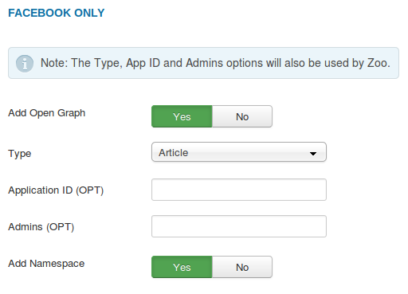{.coalaweb-docs}

#### Part 4 - Twitter Only

##### Add Twitter Card

Turn on or off the inclusion of **Twitter Card** meta tags. *\[Figure-4c\]*

##### Website @username

Here you can enter the Twitter **@username** for the website used in the card footer.*\[Figure-4c\]*

##### Content @username

Here you can enter the Twitter **@username** for the content author. *\[Figure-4c\]*

{.coalaweb-docs}

### 6. Update Options

The CoalaWeb Social Links extension integrates with the inbuilt
**Joomla Update** system so both **Core** and **Pro** users can keep their
extension up to date. For the **Pro** users you will have to copy and
paste your **Download ID** into this field to allow the update system to
work. Once you have added your **Download ID** the message displayed in
the **Control Panel** will disappear. If you try to update and it fails
make sure you still have a valid subscription and the **ID** is correct. *\[Figure-6\]*

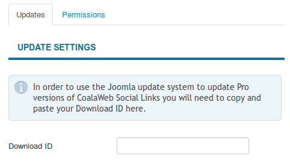{.coalaweb-docs}

### 7. Where Is My Download ID \[Pro Version\]

To find your **Download ID** log into **coalaweb.com** and from the top
menu select **Members \> My Subscriptions** scroll down and under **My
Subscriptions** there is a Module called **Download ID** copy the
code and paste in your component configuration making sure not
to include any spaces. *\[Figure-7\]*

{.coalaweb-docs}

### 8. Component Permissions

The last tab contains the permission settings for the CoalaWeb Social
Links component. *\[Figure-8\]*

{.coalaweb-docs}

## Social Links Module

### General Display Options

To make it easier to follow I have broken up the **General Display Options** into three parts.

#### Part 1

In this section you can choose the icon style, size and alignment, title alignment as well as the title format. *\[Figure-9\]*

Want to create a custom theme? Have a look at [Creating a Custom Theme](#mod-custom-theme)

{.coalaweb-docs}

#### Part 2

You also have the option to turn on or off the display of the **Share This** or **Follow Us** sections. *Note: individual items are controlled in later sections.* You can also choose if you want borders around the different sections of the module as well as their width, the modules overall width as a percentage and for the *PRO* users you can also select the module layout. *\[Figure-9a\]*

{.coalaweb-docs}

### Creating a Custom Theme

Creating a theme is easy, just copy the custom-example folder found in:

`media → coalawebsocial → components → sociallinks → themes-icon`

Give the theme a different name, edit the files as needed and of course add your custom icons. 
All the folders located in the themes-icon directory will automatically be listed in the **Icon Styles** select list.

#### Part 3

The last General Display options control if the buttons should be opened in a **Popup Window**. I recommend having it on for the Share buttons and off for the Follow Us buttons. *\[Figure-9b\]*

{.coalaweb-docs}

### Share This General

To make it easier to follow I have broken up the **Share This General** into two parts.

#### Part 1 - Default

If you want the same title to be used for all of the BookMark This icons
all of the time add it here. If have chosen a default link I recommend
you add a default title as well. If left blank the current title will be
used. If you want the same link to be used for all of the BookMark This
icons all of the time add it here. If left blank the current URL will be
used. - Note: When adding your link use the domain minus the http://
only add the link in the following format www.socialmedia.com. *\[Figure-10\]*

{.coalaweb-docs}

#### Part 2 - Display

This section controls what is displayed in the **Share This** part of
the module. You can choose to display a title including what text will
be displayed. *Note: If your site is multilingual leave blank and use
the language files.* You can also choose the color of the title and the
border color but only if you selected yes to **Display Borders** in the
**General Display Options** section. This border will surround the
**Share This** part of the module. You can enter a \# followed by a
color reference code such as \#000000 for black or you can use the color
chooser box to the right of the input field. The last option is used to display some text above the **Share This** section of the module. *\[Figure-10a\]*

{.coalaweb-docs}

### Share This Social

To make it easier to follow I have broken up the **Share This Social Options** into two parts.

#### Part 1 - Facebook

Facebook has announced that they have deprecated the **Sharer** code in preference of their new **Share Dialog** system, which requires a Facebook App ID. If you plan to display the Facebook button you will need to create a Facebook application **first** and then copy and paste the **ID** into the **Component** options under the **General** tab. The option below will override the component if needed. For more info on how this is done read below.*\[Figure-10b\]*

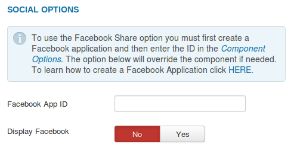{.coalaweb-docs}

### Create Facebook Application

To get a **Facebook App ID** requires you to first create a Facebook Application but don’t worry it’s an easy process which we will walk your through in this [GUIDE](http://coalaweb.com/support/documentation/item/create-facebook-application "Facebook App Guide").

#### Part 2 - Social A - Z

For the social bookmark options themselves, scroll down the list ticking the ones you want to display and that's it for the **Share This** section.*\[Figure-10c\]*

{.coalaweb-docs}

### Follow Us General

This section controls what is displayed in the **Follow Us** part of the
module. You can choose to display a title including what text will be
displayed. *Note: If your site is multilingual leave blank and use the
language files.* You can also choose the color of the title and the
border color but only if you selected yes to **Display Borders** in the
**General Display Options** section. This border will surround the
**Follow Us** part of the module. You can enter a \# followed by a color
reference code such as \#000000 for black or you can use the color
chooser box to the right of the input field. The last option is used to display some text above the **Follow Us** section of the module. *\[Figure-11\]*

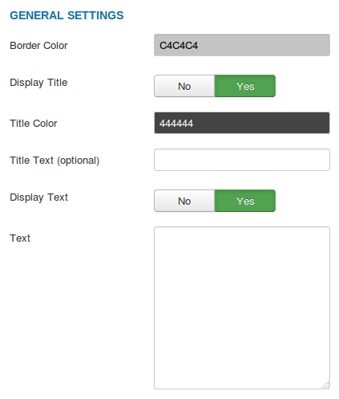{.coalaweb-docs}

### Follow Us A-Z

To make finding the social media icons easier I have broken them up into
groups of 5 letters organized alphabetically. For example if you are
look for Facebook just select the F -J group. Just work your way through
the groups ticking the ones you want to display and adding their
corresponding links. *\[Figure-11a\]*

{.coalaweb-docs}

When adding links use the domain without the http:// for example **www.facebook.com** or for **Mail Us** email@social.com 

### Follow Us Custom

Due to popular demand there is now a **Custom Option** and for *PRO*
users **Three Custom Options** to help with those situation where only a
custom icon will do. To add a custom icon is very similar to a standard
**Follow Us** option you have to chose to display it, add a link and
then two more options. First is the **Hover Text** this displays when
the icon is hovered over by a mouse. Secondly and more importantly is
the ability to select the **Custom Icon** you want to display keeping in
mind what size you selected in the **General Options**. The last option
allows you to link to an externally located icon just enter the complete
url for example http://coalaweb.com/images/example.png. *\[Figure-11b\]*

When adding links use the domain without the http:// for example **www.facebook.com**.

{.coalaweb-docs}

### Advanced Options

To make it easier to follow I have broken up the **Advanced Options** into two parts.

#### Part 1

The CoalaWeb Social Links module also has a few of what I consider
**Advanced Options** such as the option to assign a **Unique Module ID**
to stop conflicts. You can also give the it a **Module Class Suffix** or
choose whether to use **Cache** including the **Cache Time**. There is
also an option to turn off the **Module css** if you want to add your
own styling. Next is the **NoFollow** option that provides a way to tell
search engines not to follow a particular link. In the last option you can choose to have the links open in a new browser tab when clicked or open in a small **Popup** window. *\[Figure-12\]*

{.coalaweb-docs}

#### Part 2 - Show Support

The last option is whether to display a **Link Back to CoalaWeb** as
always it's appreciated but its up to you plus you can choose what text
to display next to the link. *Note: If your site is multilingual leave
blank and use the language files. \[Figure-12a\]*

{.coalaweb-docs}

## Social Tabs Module \[Pro Version\]

### First Thing

The first thing you will need to do to ensure that the Social Tabs module functions
correctly is to publish it to the right position. I recommend using **debug**
as it won't affect anything on your system and it's an avaliable module position
in all templates. *\[Figure-25\]*

{.coalaweb-docs}

### General Display Options

To make it easier to follow I have broken up the **General Display Options** into three parts.

#### Part 1

In this section you can choose which **Side** you want the module to display on, the 
**Offset** (the amount of space from the top or bottom of the page) and either **Top** or **Bottom**. *\[Figure-25a\]*

{.coalaweb-docs}

#### Part 2

In this section you can choose to disable the module on either **Mobiles** or **Mobiles and Tablets** 
which leads into the next two settings. The next two options allow you to define
the width of each of these types of devices which act as the trigger to disable the module. 
The default settings will be sufficient in most situations. *\[Figure-25b\]*

{.coalaweb-docs}

Note: If Social Tabs using jQuery is loaded on a device with a screen size smaller than **1024** the slide out effect is disabled.

#### Part 3

The last General Display options control if the buttons should be opened in a **Popup Window**. I recommend having it on for the Share buttons and off for the Follow Us buttons. *\[Figure-25c\]*

{.coalaweb-docs}

### General Share

If you want the same **Title** to be used for all of the **Share** tabs
all of the time add it here. If have chosen a **default link** I recommend
you add a **default title** as well. If left blank the current title will be
used. If you want the same link to be used for all of the **Share** tabs all 
of the time add it here. If left blank the current URL will be
used. - Note: When adding your link use the domain minus the http://
only add the link in the following format www.socialmedia.com. *\[Figure-25c\]*

{.coalaweb-docs}

### Share A-Z

To make it easier to follow I have broken up the **Share Options** into two parts.

#### Part 1 - Facebook

Facebook has announced that they have deprecated the **Sharer** code in preference of their new **Share Dialog** system, which requires a Facebook App ID. If you plan to display the Facebook tab you will need to create a Facebook application **first** and then copy and paste the **ID** into the **Component** options under the **General** tab. The option below will override the component if needed. For more info on how this is done read below. *\[Figure-25d\]*

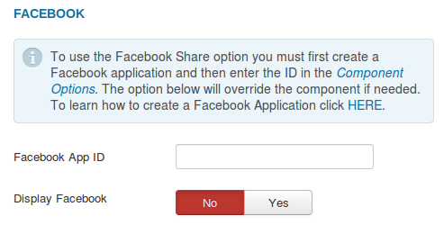{.coalaweb-docs}

### Create Facebook Application

To get a **Facebook App ID** requires you to first create a Facebook Application but don’t worry it’s an easy process which we will walk your through in this [GUIDE](http://coalaweb.com/support/documentation/item/create-facebook-application "Facebook App Guide").

#### Part 2 - Social A - Z

For the social share options themselves, scroll down the list ticking the ones you want to display and that's it for the **Share** section.*\[Figure-25e\]*

{.coalaweb-docs}

### Follow Us A-Z

To make finding the social media icons easier I have broken them up into
groups of 5 letters organized alphabetically. For example if you are
look for Facebook just select the F - J group. Just work your way through
the groups ticking the ones you want to display and adding their
corresponding links. *\[Figure-25f\]*

{.coalaweb-docs}

When adding links use the domain without the http:// for example **www.facebook.com** or for **Mail Us** email@social.com 

### Follow Us Custom

Due to popular demand there is now a **Custom Option** to help with those situation where only a
custom icon will do. To add a custom icon is very similar to a standard
**Follow Us** option you have to chose to display it, add a link and
then two more options. First is the **Hover Text** this displays when
the icon is hovered over by a mouse. Secondly and more importantly is
the ability to select the **Custom Icon** you want to display keeping in
mind what size you selected in the **General Options**. The last option
allows you to link to an externally located icon just enter the complete
url for example http://coalaweb.com/images/example.png. *\[Figure-25g\]*

When adding links use the domain without the http:// for example **www.facebook.com**.

{.coalaweb-docs}

### Tab Colors

In this section you have two option to choose for each of the tabs including the custom ones. The first one is the default background color of a particular tab and the second one is the hover color that the tab will change to when hovered over. You can click the input to use a popup color selector or enter the colors ***Hex** code minus the **#**. *\[Figure-25h\]*

{.coalaweb-docs}

### Tab Order

In this section you can choose the order you want the tabs to be displayed in. To reorder the tabs just drag and drop them to the location you want them displayed its that simple. *\[Figure-25i\]*

To make it easy to identify which tab is which I have added a key letter to the end of each of their names for more details see below.

#### Tab Key:
* [S]=Share
* [F]=Follow
* [C]=Custom

{.coalaweb-docs}

### Advanced Options

To make it easier to follow I have broken up the **Advanced Options** into two parts.

#### Part 1

First you get the choice to use **CSS** for the rendering of the module or **jQuery**.

Note: jQuery is loaded by default on Joomla 3.x but if you don't have it loaded on your system and you would like to use the jQuery option turn it on in the included **System - CW Gears plugin**.

 *\[Figure-25d\]*

{.coalaweb-docs}

#### Part 2

In this section you have the option to assign a **Unique Module ID**
to stop conflicts. You can also give the it a **Module Class Suffix** or
choose whether to use **Cache** including the **Cache Time**. Next is the 
**NoFollow** option that provides a way to tell
search engines not to follow a particular link. In the last option you can choose to have the links open in a new browser tab when clicked or open in a small **Popup** window. *\[Figure-25e\]*

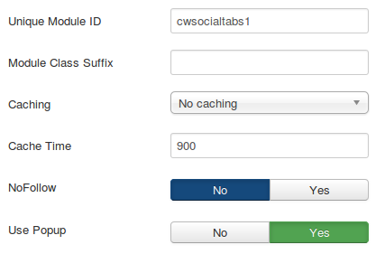{.coalaweb-docs}

## Facebook Likebox Module

The like box is a social module that enables Facebook Page owners to
attract and gain likes from their own website. The like box enables
people using your website to do the following:

-   See how many people like the Page, and which of their friends like
    it, too.
-   Read recent posts from the Page.
-   Like the Page with one click, without needing to visit the Page.

Quote: The minimum supported widget width is 292 pixels.

### General Options

The first option in this section allows you to add your Facebook page.
The easiest way to do that is open up your page and copy and paste the
link in the box. Note: The URL should be in the following format
https://www.facebook.com/CoalaWeb. The last option is
to select what format you want the widget to display in you have a
choice of HTML5, XFBML and IFRAME. *\[Figure-13\]*

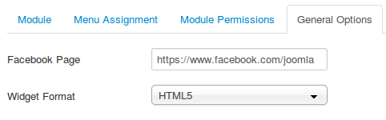{.coalaweb-docs}

### Layout Options

A word on **Responsiveness** I have tried to make the CoalaWeb Like Box
Module as responsive as possible with in the limitations enforced by
Facebook. To get the best results I recommend leaving the **Widget Min
Width** small and just adjust the height to get the
best result possible.

This brings me to the actual options available in this section the first
one is the **Widget Min Width** set this to something small as some
responsive template frameworks will try to shrink down a module before
moving it entirely as the page width decreases. Next is the **Widget
Height** here I recommend testing a few different heights with the other
setting you have chosen I find 500 quite good if for example you are
**Displaying Faces** and the **Stream**. Note: If you do not see the
faces, please set a bigger height (e.g. 630). The next option is the
**Module Width** not to be confused with the **Widget Width** this is
the surrounding Joomla module. You might want to reduce this width if
for example you only have two modules displayed at the bottom of your
page and you want the Like Box to be a bit more compact. *\[Figure 14\]*

{.coalaweb-docs}

### Style Options

This section contains some style options the first one is the **Color
Style** you have a choice of Light or Dark. *Note: These widget color
styles are controlled by Facebook.* The next option allows you to turn
on or off a **Border** around the widget. The next one allows to chose
if you want the small **Face** boxes to be displayed in the module. The
last one gives you the option to turn on or off the Facebook **Header**
at the top of the module. *\[Figure-15\]*

{.coalaweb-docs}

### Extra Options

In the this section you have two option the first one is the choice of
turning on or off the display of a **Stream** of the latest posts from
your Page's wall. The second option is **Force Wall** this is for
Places, specifies whether the stream contains posts from the Place's
wall or just checkins from friends. *\[Figure-16\]*

{.coalaweb-docs}

### Advanced Options

The CoalaWeb Social Links module also has a few of what I consider
**Advanced Options** such as the option to assign a **Unique Module ID**
to stop conflicts, a **Module Class Suffix** or whether to use **Cache**
including the **Cache Time**. This next option allows you to load the
**Facebook JavaScript library**. It works with the XFBML and HTML5
layouts and should only be loaded once so if you are using other
Facebook widgets only select yes in one of them. There is also an option
to turn off the **Module css** if you want to add your own styling. Next
is the **NoFollow** option this provides a way to tell search engines
don't follow a particular link. 

The last option is whether to display a
**Link Back to CoalaWeb** which is always appreciated but its up to you
plus you can choose what text to display next to the link. *Note: If
your site is multilingual leave blank and use the language files. \[Figure-17\]*

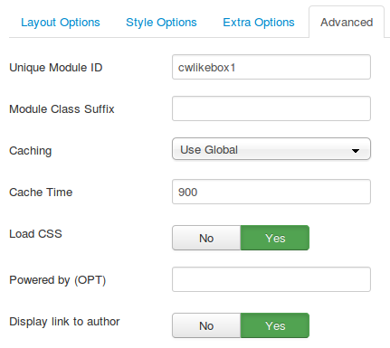{.coalaweb-docs}

## Google Plus Module \[Pro Version\]

CoalaWeb G Plus is a social module that helps you link your Google+ page
to your site. Get more recommendations for your site in Google search
and grow your audience on Google+.

You have a choice of the following badge types:

-   Page
-   Profile
-   Community

Valid Ranges: Portrait 180-450 px Landscape 273-450px 

### General Options

The first thing you will need to decide is what type of badge you want
to display. You have the option to display a Profile, Page or Community
depending on your needs. You will only need to fill in one of the next
three options based on your type choice. *\[Figure-18\]*

If you need more than one type of badge just create another module.

{.coalaweb-docs}

### Layout & Style Options

To make it easier to follow I have broken up the **Layout & Style Options** into two parts.

#### Part 1

The options found here will affect all the badge types. The first one is
**Layout**, you can choose to display the badge in Portrait \[Vertical\]
or Landscape \[Horizontal\]. Next you have the option to choose the width
of the badge in pixels. The following ranges are valid: Portrait layout
180-450 pixels Landscape layout 273-450 pixels. Next you have a choice
of Light or Dark. Note: These badge color styles are controlled by
Google. The next option specifies whether or not to show the tag line
and the last option is whether or not to display the cover photo in the
badge. Note: Only if the photo exists. *\[Figure-18a\]*

{.coalaweb-docs}

#### Part 2

The next option is to Display Owners this is only aplicable to the
Community type badge. The last option is the Module Alignment here you
can choose one of three options Left, Right or Center. *\[Figure-18b\]*

{.coalaweb-docs}

### Advanced Options

To make it easier to follow I have broken up the **Advanced Options** into two parts.

#### Part 1

The CoalaWeb G Plus module also has a few of what I consider **Advanced
Options** such as the option to assign a **Unique Module ID** to stop
conflicts. You can also give the it a **Module Class Suffix** or choose
whether to use **Cache** including the **Cache Time**. There is also
options to turn on or off the **Module CSS** and **Google JS**if you
want. *\[Figure-18c\]*

{.coalaweb-docs}

#### Part 2 - Show Support

The last option is whether to display a **Link Back to CoalaWeb** as
always it's appreciated but its up to you plus you can choose what text
to display next to the link. *Note: If your site is multilingual leave
blank and use the language files. \[Figure-18d\]*

{.coalaweb-docs}

## Plugins

### Social Likes \[Pro Version\]

The **CoalaWeb Social Likes** plugin is a content plugin designed to
display all of the popular social networking vote buttons in several
formats and locations within your **Joomla** and **K2 content**. All of
the configuration options for this particular plugin can be found in the
accompanying component under **Extension Options**. If you can't see the
buttons make sure you have the plugin installed and published and that
you have selected the appropriate configuration options. *\[Figure-19\]*

{.coalaweb-docs}

### Social Share \[Pro Version\]

The **CoalaWeb Social Share** plugin is a content plugin designed to display all of the popular social networking share buttons with several icon themes and locations within your **Joomla** and **K2 content**. All of
the configuration options for this particular plugin can be found in the accompanying component under **Extension Options**. If you can't see the buttons make sure you have the plugin installed and published and that
you have selected the appropriate configuration options. *\[Figure-19a\]*

{.coalaweb-docs}

### Social Panel \[Pro Version\]

Social Panel needs jQuery to function correctly. If you don't already have it loaded use the System - CW Gears plugin.

The **CoalaWeb Social Panel** is a content plugin designed to display a 
variety of social network vote buttons in your Joomla and K2 article views. 
They will be displayed in a vertical collapsible bar to the side of the article 
content. All of the configuration options for this particular plugin can be found in the
accompanying component under **Extension Options**. If you can't see the
buttons make sure you have the plugin installed and published and that
you have selected the appropriate configuration options. *\[Figure-20\]*

{.coalaweb-docs}

### Social Metadata \[Pro Version\]

This plugin takes care of adding **Social Metadata** to your website for Joomla content. It includes the option to add **Open Graph** tags and **Twitter Card** tags to make sharing and voting much more accurate and professional.

To make it easier to follow I have broken up **Social Metadata** into two parts.

#### Part 1 - Open Graph

**What is Open Graph?**

> An Open Graph object is a regular web page with additional structured
> data marked up using RDFa Core 1.1 syntax placed in your HTML
> document's element. A Facebook server downloads a copy of your web
> page, extracts relevant data, and stores an object representation for
> future use. Facebook attempts to extract relevant data from links
> shared on Facebook as well as URL properties passed as part of an Open
> Graph action.

Facebook Open Graph objects are marked up using Open Graph protocol,
properties specific to Facebook, and properties specific to your
Facebook application.

The CoalaWeb Social Metadata plugin allows you to add default values for the
parameters outlined below or dynamically populates them in a variety of
different ways see [Social Metadata Options](#options-og) for
more details. *\[Figure-21\]*

##### Open Graph Parameters

-   og:url
-   og:type
-   og:title
-   og:image
-   og:description
-   og:site\_name
-   fb:app\_id (Optional)
-   fb:admins (Optional)

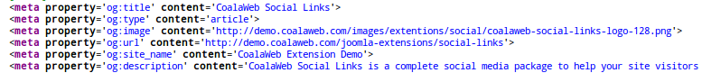{.coalaweb-docs}

#### Part 2 - Twitter Card

**What is a Twitter Card?**

>With Twitter Cards, you can attach rich photos, videos and media experience to Tweets that drive traffic to your website. Simply add a >few lines of HTML to your webpage, and users who Tweet links to your content will have a “Card” added to the Tweet that's visible to >all of their followers.

The CoalaWeb Social Metadata plugin allows you to add default values for the
parameters outlined below or dynamically populates them in a variety of
different ways see [Social Metadata Options](#options-og) for
more details. *\[Figure-21a\]*

##### Twitter Card Parameters

-   twitter:url
-   twitter:title
-   twitter:image
-   twitter:description
-   twitter:creator
-   twitter:site
-   twitter:card

{.coalaweb-docs}

### Facebook JS

This plugin has been specifically designed to load the Facebook JavaScript library making it available to all the parts of the **Social Links** system while ensuring it is only loaded once. It also incorporates the Facebook **Application ID** entered in the component configuration options. *\[Figure-21b\]*

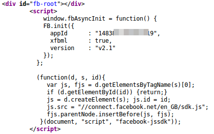{.coalaweb-docs}

### Zoo \[Pro Version\]

The **CoalaWeb Zoo** plugin is a system plugin designed to integrate **custom elements & layouts** into your Zoo applications. Currently there are two custom elements created by this plugin and they are explained in detail below.

#### Custom Element - Social Likes

This custom element integrates a variety of popular social
vote and or share buttons into your zoo applications. Once the plugin is installed
and publish you will be able to carry out the following steps to get them
displaying through out your Zoo content.

#### Step 1
Open up **Zoo** and click the small **Gear Icon**. *\[Figure-22\]*

{.coalaweb-docs}

#### Step 2
Now select the **App** you want to add the CoalaWeb Social Likes button
too for this example we will choose Blog so click **Blog** and then
select **Article \> Edit Elements**. *\[Figure-22a\]*

{.coalaweb-docs}

#### Step 3
If the plugin was installed and published properly you should now have a
new element available under **Social** called **CoalaWeb Social Likes**
click it once to add it to your **Article** layout. *\[Figure-22b\]*

{.coalaweb-docs}

#### Step 4
Now give your new element a **Name**, **Description** and choose the
appropriate settings for the other options, when you are ready click
**Save & Close**. *\[Figure-22c\]*

{.coalaweb-docs}

#### Step 5
Now we need to add the newly available element to our **Template** for
this example we are using the **Default template** and the **Full
Layout**. *\[Figure-22d\]*

{.coalaweb-docs}

#### Step 6
Once the new window has opened you can drag and drop the **CoalaWeb
Social** Custom element over to your desired location in this example I have chosen
**Bottom**. Feel free to turn on or off the **Label** or even give it an
**Alternative Label**. When you are happy click **Save & Close**. *\[Figure-22e\]*

{.coalaweb-docs}

#### Step 7
Now in each of your **Articles** you will have a new option named what you
chose back at the start in our case **CoalaWeb Social**. Just set it to **Yes**
and the buttons will magically appear. *\[Figure-22f\]*

{.coalaweb-docs}

#### Custom Layout - Open Graph

This custom layout integrates **Open Graph** metadata into your Zoo content which makes sharing and voting much more accurate and professional.

The **Open Graph** tags added to your **Zoo** content will come from two sources which are explained in detail below.

#### Source 1

The first source is the **Component Configuration Options** and they cover the follow **Open Graph** tags.
-   og:type
-   fb:app\_id (Optional)
-   fb:admins (Optional)

#### Source 2 

The second source is the **CW Open Graph Extension Layout** which covers the following **Open Graph** tags.

-   og:url
-   og:title
-   og:image
-   og:image:width
-   og:image:height
-   og:description

Setting up the **CW Open Graph Extension Layout** is easy just follow the steps outlined below.

#### Step 1
Open up **Zoo** and click the small **Gear Icon**. *\[Figure-22g\]*

{.coalaweb-docs}

#### Step 2
Now select the **App** you want to add the **Open Graph** tags too for this example we will be using **Blog**. In the next screen you should now see a new **Article Extension Layout** called **CW Open Graph** select it to move onto the next step. *\[Figure-22h\]*

{.coalaweb-docs}

#### Step 3
In this step you will need to **Drag and Drop** the relevant **Core** and **Custom** items over to their **Open Graph Positions**. If you are not sure what to place where use the image below as a guide. *\[Figure-22i\]*

{.coalaweb-docs}

Now if you check the source code of one of your **Zoo Content Items** you should now see Open Graph tags. *\[Figure-22j\]*

{.coalaweb-docs}

## Need More Help

Do you have a question that wasn't covered by the GUIDE? Try the [FAQ](http://coalaweb.com/support/documentation/category/joomla).

Do you have a question that wasn't covered by the GUIDE or the FAQ? Then it's time to drop by the [Forum](http://coalaweb.com/forum/index) I'm sure we can help.