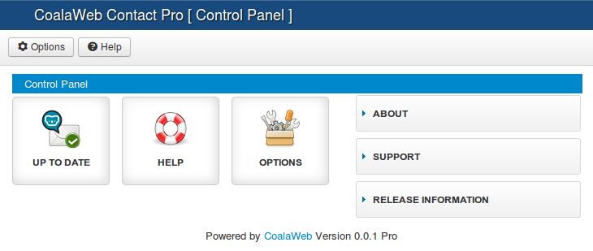
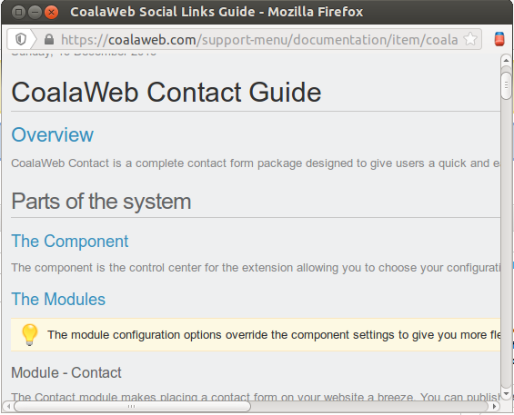

## Table of Contents {#toc}
1.  [Component Guide](#component-guide)
    -   [Control Panel](#control-panel)
    -   [One Click Updates](#updates)
    -   [Inbuilt Help](#help)
    -   [Extension Options](#options)
        - [1. General Contact Options](#options-general)
        - [2. Messages and Warnings](#options-messages)
        - [3. Labels](#options-labels)
        - [4. Captcha Options](#options-captcha)
        - [5. Live Update Options](#options-updates)
        - [6. Where Is My Download ID \[Pro\]](#options-downloadid)
        - [7. Component Permissions](#options-permissions)
2.  [Contact Module Guide](#module)
    -   [General Display Options](#mod-general)
    -   [Capctha Options](#mod-captcha)
    -   [Advanced Options](#mod-advanced)
    -   [Release Information](#mod-release)
3.  [Plugin Guide \[Pro\]](#plg)
    -   [Content Plugin - Contact](#plg-content)
    -   [Editor XTD Plugin - Contact](#plg-xtd)
4.  [Need More Help?](#more-help)

##Component - [Back to Top](#toc) {#component-guide}
### Control Panel - [Back to Top](#toc) {#control-panel}

The **Control Panel** as seen below is designed to be an easy starting
point, think of it as the head quarters for the extension. While
carrying out tasks you can easily jump from the **Control Panel** to the
different sections and then return before moving onto the next one.
*[Figure 1]*

{.coalaweb-docs}

### Inbuilt Help - [Back to Top](#toc){#help}

In the control panel or the tool menu you have a help icon that when
clicked will open a pop up wrapper of this specific guide. This gives
you an easy way of checking the functionality of a particular item with
out leaving the control panel. *[Figure 2]*

{.coalaweb-docs}

### One Click Updates - [Back to Top](#toc){#updates}

#### Coming Soon!

### Extension Options - [Back to Top](#toc){#options}

In the control panel or the tool menu you have a options icon that when
clicked will open a pop up containing the various extension options.

#### 1. General Contact Options - [Back to Top](#toc){#options-general}

The options below will influence the Content Plugin [Pro] and the
Contact Module unless overridden in the module configuration.

To make it easier to follow I have broken up the General settings into
three parts.

#### Part 1

The first thing that will need to be filled in is the **Recipient
Email** without this the system will display an error message. If you
have purchased a Pro subscription you will also have two optional fields
avaliable a CC Email and a BCC email. Next you have a **Default
Subject** option this will display in the email subject followed by the
submitters subject if you have chosen to display this option. Lastly you
have an option to chose the format you wish the emails to be sent in. If
you are using the core version you will only have the **No HTML** option
but for Pro users you will have two additional options of **Basic HTML**
and **Rich HTML**. *[Figure 3]*

{.coalaweb-docs}

#### Part 2

Next we have some **Field Display** options that will affect what and
how items are displayed within the contact form. Firstly you have the
option to display a **Name** or **Subject** input field and if they
should be required fields. Next you can chose to display a **Copy Me**
field allowing users to receive a copy of the form when they submit it.
The last two options are for the **Pro** subscribers and they allow you
to set and display the **Character Limit** for the message field of the
form. *[Figure 4]*

{.coalaweb-docs}

#### Part 3

Lastly we have some **Layout & Style** options that will affect the look
and feel of the contact form. The first one gives you the option to
include the CSS included with the CoalaWeb Contact extension or not. The
next option allows you to choose a **Theme** for the contact form.
**Core** users only have one option while the **Pro** subscribers get
two.

#### Creating your own theme

Creating a theme is easy, just copy the light folder found in:

`media → coalawebcontact → components → contact → themes`

Give the theme a differnt name and edit the files as needed. All the
folders located in the themes directory will automatically be listed in
the **Form Theme** select list. Next you can choose the width of the
contact form in %. The next option allows you to choose a **Button
Style** for the contact form. **Core** users only have the default
option while the **Pro** subscribers get 6 color options as well. The
last two options allow you to choose the text to be displayed on the
**Submit** button at the bottom of the contact form and for the **Pro**
users the button displayed at the bottom of the editor window allowing
you to insert a form into your content. *[Figure 5]*

{.coalaweb-docs}

#### 2. Messages and Warnings - [Back to Top](#toc){#messages}

The next tab allows you to customize the **Messages and Warnings**
displayed by the CoalaWeb Contact extension. Note: If your site is
multilingual leave blank and use the language files. *[Figure 6]*

{.coalaweb-docs}

#### 3. Labels - [Back to Top](#toc){#options-labels}

The next tab allows you to customize the **Labels** displayed by the
CoalaWeb Contact extension both in the forms and the sent e-mail. Note:
If your site is multilingual leave blank and use the language files.
*[Figure 7]*

{.coalaweb-docs}

#### 4. Captcha - [Back to Top](#toc){#options-captcha}

The next tab allows you to display a **Captcha** to attempt to reduce
pesky spam. Lets start with the options that apply to both the **Core**
and **Pro** versions of the extension. Firstly you have the option to
pick what type of Captcha you wish to display. The **Core** users only
get one option the basic question and answer type Captcha while **Pro**
users get three. Next you get to choose if you want to display a
title/hint above the Captcha.

#### Basic Captcha

The next two options are applicable when using the basic question and
answer type Captcha [The Default Captcha]. They allow you to chose a
question to be displayed and the answer to be check against before
allowing the form to be submitted. The default question is:

`Question = How wheels does a bicycle have?`

`Answer = 2`

Feel free to choose a question and answer but try to aim for a good
balance between difficult to answer for a spam bot while not too
annoying for a real user. Note: If your site is multilingual leave blank
and use the language files. *[Figure 8]*

{.coalaweb-docs}

For the Pro subscribers you get two additional Captcha options.

#### Math Captcha

This is a math question and answer type Captcha here you have the option
to choose some custom text both before and after the question. Note: If
your site is multilingual leave blank and use the language files.
*[Figure 9]*

#### ReCaptcha

Please note Recaptcha can only be displayed once on a page. I'm
currently looking into a reliable work around for this issue and I will
implement it if one becomes avaliable.

You also get the option to use ReCaptcha which will require you to Copy
and paste your Public and Private keys in fields provided and theme you
wish to use.

To get started grab your Public and Private keys by signing in with your
Google account (create an account if you don't have one) here: [Create a
reCAPTCHA key](https://www.google.com/recaptcha/admin/create). Once you
have an account register your website domain, and Google will provide
you with your ReCaptcha keys. *[Figure 9]*

{.coalaweb-docs}

#### 5. Live Update Options - [Back to Top](#toc)

The CoalaWeb Contact extension comes with a built in one click **Live
Update** system so both **Core** and **Pro** users can keep their
extension up to date. For the **Pro** users you will have to copy and
paste your **Download ID** into this field to allow the update system to
work. Once you have added your **Download ID** the message displayed in
the **Control Panel** will disappear. If you try to update and it fails
make sure you still have a valid subscription and the **ID** is correct.
*[Figure 10]*

{.coalaweb-docs}

#### 6. Where Is My Download ID [Pro] - [Back to Top](#toc){#options-downloadid}

To find your **Download ID** log into **coalaweb.com** and from the top
menu select **Members → My Subscriptions** scroll down and under **My
Subscriptions** there is a Module called **Download ID** now copy the
code and paste it back in your component configuration making sure not
to include any spaces. *[Figure 11]*

{.coalaweb-docs}

#### 7. Component Permissions - [Back to Top](#toc){#options-permissions}

The last tab contains the permission settings for the CoalaWeb Contact
component. *[Figure 12]*

{.coalaweb-docs}

## Contact Module - [Back to Top](#toc){#module}
{.coalaweb-docs}

### General Display Options - [Back to Top](#toc){#mod-general}

The options below will overridden the component configuration.

To make it easier to follow I have broken up the General settings into
three parts.

#### Part 1

The first thing that will need to be filled in is the **Recipient
Email** with out this the system will display an error message. If you
have purchased a Pro subscription you will also have two more fields
avaliable a CC Email and a BCC email option fill these in as necessary.
Next you have a **Default Subject** option this will display in the
email subject followed by the submitters subject if you have chosen to
display this option. *[Figure 13]*

{.coalaweb-docs}

#### Part 2

Next we have some **Field Display** options that will affect what and
how items are displayed with in the contact form. Firstly you have the
option to display or not a Name or Subject input field you can also
chose to have it as a required field. Next you can chose to display a
Copy Me field allowing users to receive a copy of the form when they
submit it. The last two option are for the **Pro** subscribers and they
allow you to set and display the Character Limit for the message field
of the form. *[Figure 14]*

{.coalaweb-docs}

#### Part 3

Lastly we have some **Layout & Style** options that will affect the look
and feel of the contact form. The first option allows you to choose a
**Theme** for the contact form. **Core** users only have one option
while the **Pro** subscribers get two.

#### Creating your own theme

Creating a theme is easy just copy the light folder found in:

`media → coalawebcontact → components → contact → themes`

Give it a different name and edit as needed all the folders in the
themes folder will automatically be listed in the **Form Theme** select
list. Next you can choose the width of the contact form in %. The next
option allows you to choose a **Button Style** for the contact form.
**Core** users only have the default option while the **Pro**
subscribers get 6 color options as well. The last two options allow you
to choose the text to be displayed on the **Submit** button at the
bottom of the contact form and for the **Pro** users the button
displayed at the bottom of the editor window allowing you to insert a
form into your content. *[Figure 15]*

{.coalaweb-docs}

### Captcha - [Back to Top](#toc){#mod-captcha}

The next options group allows you to display a **Captcha** to attempt to
reduce pesky spam. Lets start with the options that apply to both the
**Core** and **Pro** versions of the extension. Firstly you have the
option to pick what type of captcha you wish to display the **Core**
users only get one option the basic question and answer type Captcha
while **Pro** users get three. Next you get to chose if you want to
display a title/hint above the Captcha.

#### Basic Captcha

The next two options are applicable when using the basic question and
answer Captcha they allow you to chose a question to be displayed and
the answer to be check against before allowing the form to be submitted.
The default question is:

`Question = How wheels does a bicycle have?`

`Answer = 2`

Feel free to chose a question and answer but try to aim for a good
balance between difficult to answer for a spam bot while not too
annoying for a real user. Note: If your site is multilingual leave blank
and use the language files. *[Figure 8]*

{.coalaweb-docs}

For the Pro subscribers you get two additional Captcha options.

#### Math Captcha

This is a math question and answer type Captcha here you have the option
to chose some custom text both before and after the question. Note: If
your site is multilingual leave blank and use the language files.
*[Figure 17]*

{.coalaweb-docs}

#### ReCaptcha

Please note Recaptcha can only be displayed once on a page. I'm
currently looking into a reliable work around for this issue and I will
implement it if one becomes avaliable.

You also get the option to use ReCaptcha which will require you to Copy
and paste your Public and Private keys into the component configuration
as well as choosing the theme you wish to use also in the component
configuration. *[Figure 9]*

### Advanced Options - [Back to Top](#toc){#mod-advanced}

The CoalaWeb Contact module also has a few of what I consider **Advanced
Options** such as the option to assign a **Unique Module ID** to stop
conflicts, a **Module Class Suffix** and whether to use **Cache**
including the **Cache Time**. The last option is whether to display a
**Link Back to CoalaWeb** as always it's appreciated but its up to you
plus you can choose what text to display next to the link. Note: If your
site is multilingual leave blank and use the language files. *[Figure
18]*

{.coalaweb-docs}

##Plugins [PRO Version Only]- [Back to Top](#toc){#plg}
### Content Plugin - Contact - [Back to Top](#toc){#plg-content}

The CoalaWeb Contact plugin gives you even more flexibility by allowing
you to place one or more contact forms anywhere within your content. All
of the configuration options for this particular plugin can be found in
the accompanying component under **Extension Options**. If you can't see
the contact form displayed in your content make sure you have the plugin
installed and published and that you have selected the appropriate
configuration options.

{.coalaweb-docs}

### Editor XTD Plugin - Contact - [Back to Top](#toc){#plg-xtd}

The **Editor XTD** plugin makes adding a contact form to your Joomla
content a one click process. Just place the cursor where you want the
form to be displayed and then click the **Insert Contact** button
displayed at the bottom of the editor.

{.coalaweb-docs}

### Need more help? - [Back to Top](#toc){#more-help}

Do you have a question that wasn't covered by the GUIDE? Try the
[FAQ](/support-menu/documentation/item/coalaweb-social-links-faq).
Do you have a question that wasn't covered by the GUIDE or the FAQ? Then it's time to drop by the [Forum](forum/coalaweb-social-links) I'm sure we can
help.
